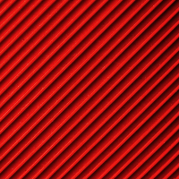
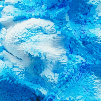
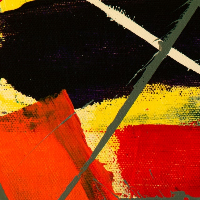
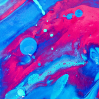
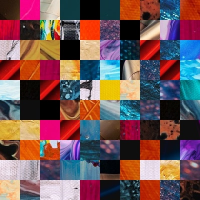

# Art Generator

Randomly generate images made up from small blocks of other images.

Cut and divide images into smaller squares of size 10x10, 20x20, 30x30 or 40x40px. Then randomly recombine to generate
new image. i.e. go from:

   

   

To:




## Installation and Running

Note: Recommended to run and install within a Python virtual environment.

In a terminal and a new directory of your choice:

```
cd PATH_TO_DIRECTORY/new_folder
```

Then populate the image directory "art_data/art/input_images/unprocessed" with images of minimum size 640x640px. 
Images larger than this will be cropped down to 640x640px.

```
git clone https://github.com/ac872/art_generator.git
pip install -r requirements.txt

python src/main.py
```

## Licence

MIT LICENSE

Copyright (c) 2021 Arbri Chili

Permission is hereby granted, free of charge, to any person obtaining a copy
of this software and associated documentation files (the "Software"), to deal
in the Software without restriction, including without limitation the rights
to use, copy, modify, merge, publish, distribute, sublicense, and/or sell
copies of the Software, and to permit persons to whom the Software is
furnished to do so, subject to the following conditions:

The above copyright notice and this permission notice shall be included in all
copies or substantial portions of the Software.

THE SOFTWARE IS PROVIDED "AS IS", WITHOUT WARRANTY OF ANY KIND, EXPRESS OR
IMPLIED, INCLUDING BUT NOT LIMITED TO THE WARRANTIES OF MERCHANTABILITY,
FITNESS FOR A PARTICULAR PURPOSE AND NONINFRINGEMENT. IN NO EVENT SHALL THE
AUTHORS OR COPYRIGHT HOLDERS BE LIABLE FOR ANY CLAIM, DAMAGES OR OTHER
LIABILITY, WHETHER IN AN ACTION OF CONTRACT, TORT OR OTHERWISE, ARISING FROM,
OUT OF OR IN CONNECTION WITH THE SOFTWARE OR THE USE OR OTHER DEALINGS IN THE
SOFTWARE.
